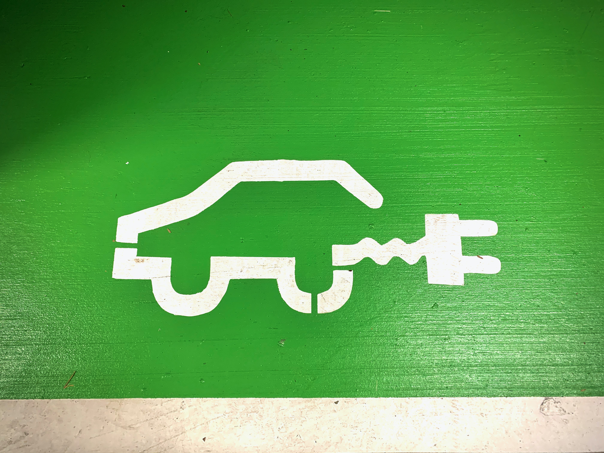

## Business Context

Fiat wants to make the 500 full-electric model its best-selling one, obtaining the largest market share for small electric cars (A & B sectors).
To do this, Fiat must attract a larger audience, convincing the “crowd” of the product’s strengths. 
In so doing, the company can leverage both the novel pro-green regulations issued by the government and the positive reactions widespread in early adopters and critics. 
However, it has also to face an always more crowded competitive arena, populated by rival companies such as Mini, Honda and its sister brands Vauxhall and Peugeot.

To help the company achive its goal the following questions need to be adressed with regards to its iconic 500 model within the UK market:
- Identify the audience sentiment, and what meanings are attached to the new 500 BEV. How do they differ from the more traditional Fiat 500 Hybrid?
- Examine if there is any difference in the audience sentiment between the FIAT brand and the “Fiat 500” brand.

## Methodology
Due to the scope of the project, the collection and analysis of the data will be bounded only to the UK market from the period between January of 2020 and August of 2022 to capture the online discussion for both electric and hybrid model that launched in the first quarter of 2020.

For the social media platform to examine, **YouTube** was chosen as the second most popular social network in January 2022 with more than 2.5 billion monthly active users and thousand comments produces on daily bases. Also YouTube is one of the main platforms that car experts and youtubers choose to examine the newly released cars and post test drives or general reviews videos. These videos due to their specific content attract an extended discussion in the comment section regarding these models with rich insights about the opinion of the general audience about the reviewed car.

### Data collection

To scrape the comments from YouTube videos, the official YouTube Data API provided by Google developers was used. [(YouTube Data API | Google Developers, 2022)](https://developers.google.com/youtube/v3)

A Python function was created that: 
- Take as input the links of the chosen videos
- Extracts the video ID from them
- Requests the comments from this video. 
- The pageToken was used to extract comments from the next pages of the section (overcome limit of 100 comments) 

This resulted in the collection of all the first-level comments along with their replies for each video containing features such as:
- **Commenter's name** and **ID**, **Comment Text**, the **Time Posted** and **Time Updated**, and the **Video Link**. 

### Natural Language Processing tools

1. **LDA Topic Modelling**
   
   *To uncover hidden topics discussed about the two models and the two brands in the online comments.* 
   
2. **Lexicon-based Sentiment Analysis (VADER lexicon)**

   *To identify the opinions of the people regarding the examined items in the online discussion.*

3. **Pointwise Mutual Information (PMI)**

   *To form bi-grams and tri-grams of words to better understand what terms are mostly discussed in the comments and to identify factors that contribute to the positive and negative sentiments of the audience.*
   
## Results

### Fiat 500 BEV and Fiat 500 hybrid comparison

To distingue the two models’ audience sentiment, spaCy’s matcher were used to separate the combined dataset into comments for Fiat 500 BEV and hybrid. Overall, based on the sentiment analysis results presented in figures 2,3 the online audience speaks more positively for the two model than negative with the distribution of the compound for both models skew more to the higher values.

  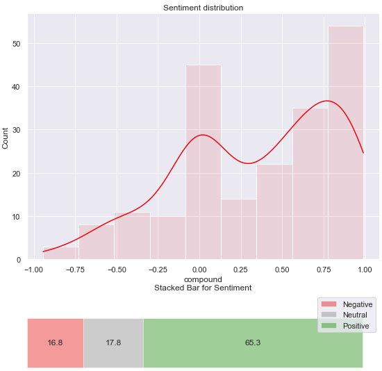 

  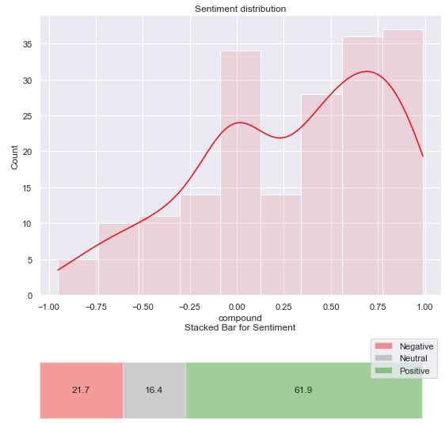 

Regarding the difference in sentiment between the two models, the electric model has slightly more positive comments than the hybrid model, with an average compound of 0.351 compared to 0.294, and more than 65% versus 62% of the comments had been positive. Additionally, 46% of the comments were extremely positive (compound > 0.5) for electric versus 41% for hybrid.

So, to identify what features create this difference in sentiment, topic modeling was performed. The results of topic modeling showed in the figure 4, 10 distinct topics are mainly discussed on the dataset with a slight overlapping between the topics mentioning the design of the car and its affordability. From the graph, topics referring to the Design of the car, its Price and its driving behavior attracting more attention from the audience, making the cluster of those topics larger.

  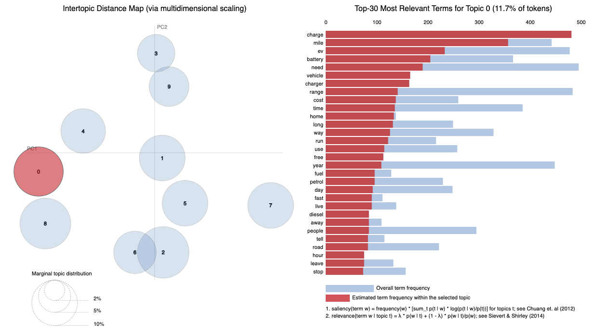 

Between these topics, a theme about the video itself appeared which is common on the platform where the audience praise the video creator. These comments however don’t have any value for the evaluation of the car and appeared to be separated for the other topics on the visualization. Therefore, to reduce the noise of the dataset, comments containing strongly these topics will be excluded. The complete list of topics can be seen in the figure 5.

  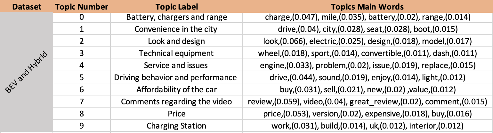 

Then, to appreciate the importance of each topic in the separation of these two models, the figures 6,7 demonstrate both the average positive attitudes per topic and the distribution of positive, negative, and neutral comments posted per topic, respectively. The graphs illustrate that for both models, the main points of discussion are the price, design and driving behavior of the car, with design being the dominant topic for hybrid and price, along with design for electric. Regarding the positive attitudes of the audience, the BEV outperforms the hybrid in price and design while being slightly lower in driving behavior.

  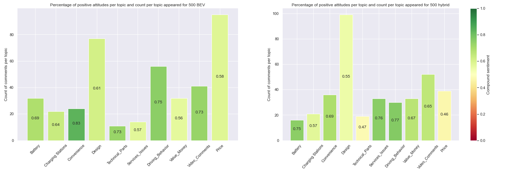 

  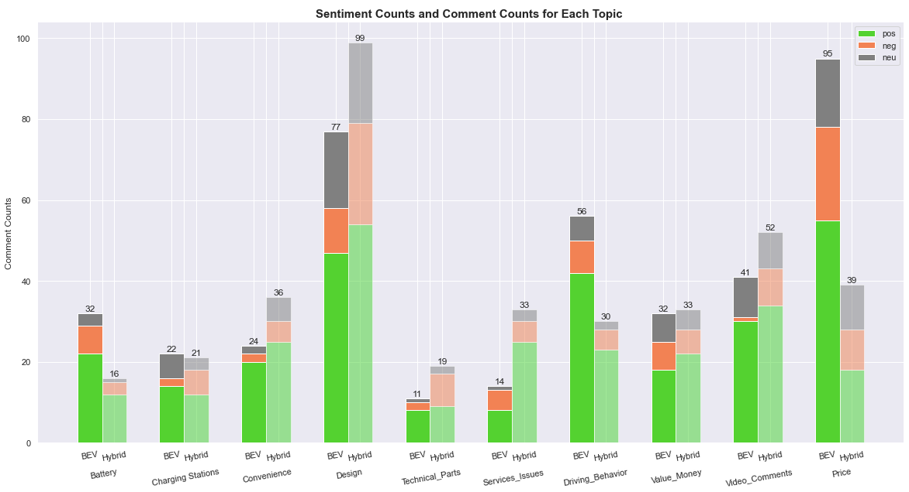 

### Insights for the electric model

These findings reveal some important information about the structure of the online conversation and the audience's perspectives about the models. According to the findings, the BEV model was more favorably received by the audience than hybrids, and its sentiment score in the main topics of the discussion is promising. More extensive research, however, is required to find the traits that can make the model appealing to a broad audience. To achieve this, the extremely positive comments were examined for the electric model, and the main topics mentioned there were again the price, design, and driving behavior. The PMI method was then used to identify any prominent terms that appeared in this topic. This strategy yielded an interesting result in the Driving behavior topic. The “one-pedal range” is one feature that appeared to through PMI to be an important factor that differentiated the model from its competitors. So, after reviewing some comments referencing this feature, it appears that it is one aspect that may persuade a potential buyer to order the car. Finally, the bigrams and trigrams analysis did not provide any useful insight on the price and design subjects due to the small number of comments and the more general content on them.

### Fiat 500 brand and Fiat brand comparison

According to the sentiment analysis data shown in figures 3, 4, both the Fiat and Fiat 500 brands receive mostly positive comments, with the percentage of them being above 55%. However, compared to the Fiat brand, the Fiat 500 brand receives substantially more favorable online audience reactions. It is observed that Fiat brand draw more neutral comments with the spike to its distribution of compound centered around 0. In contrast, the public seems to respond more favorably to the recently emerged Fiat 500 brand, with its distribution being primarily concentrated to extreme positive qualities.

  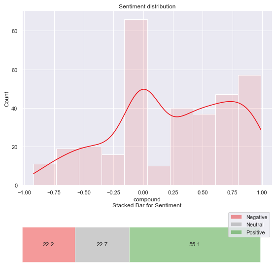 

  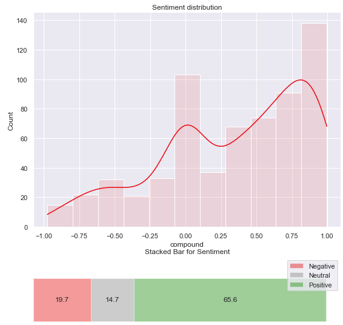 

This difference in the sentiment (average compound 0.22 versus 0.33) may indicate a clear distinction between the two brands in audience minds, but extreme values may have an impact on these results. To examine further if this difference is contrite, change of sentiment over time was plotted along with the comments collected per month. From the figure 10 the average compound considerably varies over time, generally in positive values, with the sentiment between the two brands occasionally crossing. This lack of a clear separation in the trend of both sentiments though may evidence that audience still consider the two brands as one entity and seems to use these terms interchangeably.

  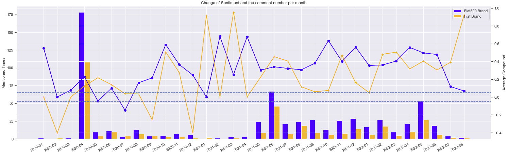 

Regarding the fluctuation of the compound score, the extreme values seem to be caused by the lack of a sufficient number of comments. This was strongly affected by the way the data was collected because comments were posted mainly in the first weeks after the video was posted, making it difficult to appreciate the evolution of discussion through time. The spikes in comments volume in April 2020 and June 2021 with the first one came from two videos posted by respected car review channels such as ‘carwow’ and ‘High Peak Autos’ that reviewed the Fiat 500 electric model after it was launched the previous month in Milan, and the second one resulted from one video from ‘High Peak Autos’ that examined the same model, which was provided as a promotion for a car dealership. In general, the Fiat 500 brand is more discussed than Fiat brand throughout the examined period with more positive opinions regarding the first one but without a consistent clear separation between them.

So, to examine if there is a feature that clearly separate these two entities, topic modeling was performed. For the figure 6, 8 distinct topics are mainly discussed on the dataset without any important overlapping between topics. From the graph, topics referring to Design and Price of the cars, driving behavior in the city and the services provided by the dealers of those brands attracting more attention from the audience, making the cluster of those topics larger.

  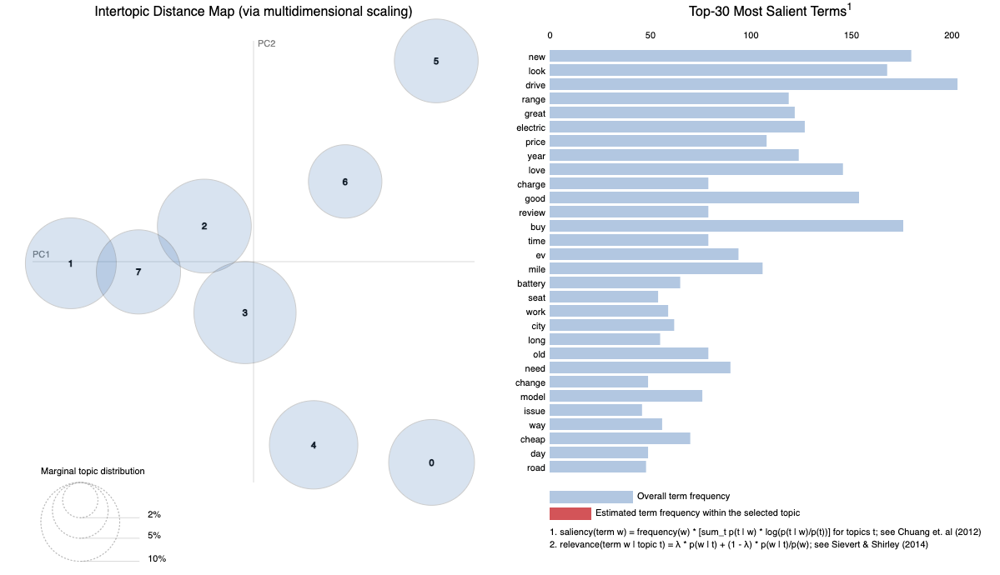 

Also in this case, comments regarding the video itself are present but it will be not taken into consideration. Other interested themes that are discussed are about the issues and services associated with fiat models, their interior configuration, battery performance and charging speeds along with the expenses coming to buy and maintain the car.

   

Then, to appreciate if there is any specific topic that clearly differentiate the two brands both in number of occurrences and sentiment, the figures 7,8 demonstrates both the average positive attitudes per topic and the distribution of positive, negative, and neutral comments posted per topic respectively.

   

According to figure 7, which shows the number of comments written per topic, the battery and charger topic appears to be distinct to the Fiat 500 brand as opposed to Fiat. These results were due to the comments in the dataset, which mainly represented the 500 brand as the two electric models. Then, due to the iconic design of the 500 models compared to the brand's other cars such as the Panda and Punto, interior configuration, design, and price appear to be focusing primarily on the Fiat 500 brand rather than Fiat.

   

Regarding the difference in sentiment between the topics, from Figure 8, a significant difference in opinions can be seen in the topics regarding issues and problems with the cars, along with the expenses for the purchase and maintenance of the car. From these topics, the audience perception about Fiat 500 brand seems to be clearly separated and improved compared to the Fiat brand, which scores significantly low on those aspects.
Similar findings appeared by applying PMI to uncover bigrams and trigrams to identify meanings attached to those brands. The results verified that the Fiat brand seems to be associated mainly with problematic cars, with frequent bi-grams such as (‘fiat’, ‘fix’), (‘fix’, ‘tomorrow’) appearing in the comments. This doesn’t seem to be the case for the Fiat 500 brand, which draws more positive comments regarding the design of the car and some innovative features such as the pedal range model. Finally, feelings like love, fun, and passion appear to have emerged alongside this brand from an audience that appears to be excited about the new models, in contrast to conservative opinions about the traditional brand.

## Recomendations
- To gain more traction in this evolving UK market, FCA is recommended to focus their marketing resources on the targeted promotion of the electric model.
- The main points that need to be highlighted in their marketing materials seem to be the design and the driving behaviour of the car.
- In these materials, features that appeared to attract extremely positive comments, such as the one-pedal range, will be important to be stressed.
- Effort to separate the new emerging brand of Fiat 500, which seems to be mostly associated with excitement and positive feelings, from the traditional Fiat brand, which is mainly associated with problematic cars.
